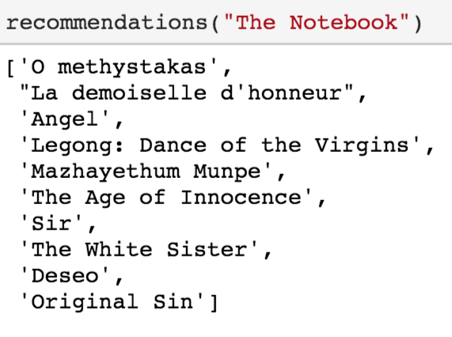

Movie Recommendation Engine using Content Based Filtering: Project Overview
----

- Using the IMDB movie dataset taken from Kaggle, the aim of this project was to create a recommendation engine using content based filtering(based on the plot of each movie). 

Code and Resources Used:
Python Version: 3.7 
Packages: pandas, numpy, nltk, countvectorizer,matplotlib, seaborn, and sklearn
Dataset: https://www.kaggle.com/stefanoleone992/imdb-extensive-dataset

Data Exploration
-- 

Data Cleaning
-- 
After reading and exploring the data, I needed to preprocess and clean it up so that it was usable.
Following Changes:
--
- Fill in missing values
- Extracted the necessary columns : title, director, actors, genre, description 
- Using nltk, I preprocessed the description column
- Used count vectorizer because the presence of the actors and directors are essential especially if he/she has acted directly in relatively more movies

Consine Similarity Matrix
--
- computed the consine similarity matrix
- retrieved the index of the movie that matches the title
- sorted the series of the similarity scores
- index the 10 similar movies

Recommendation
---

